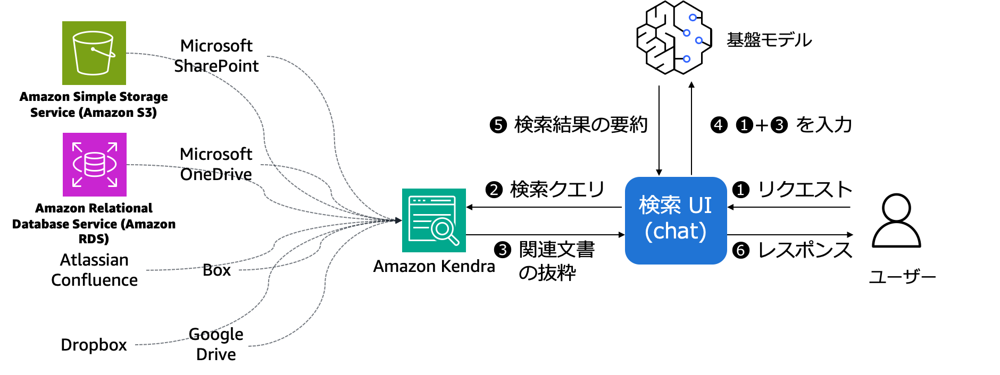

# RAG powered by Amazon Kendra & Rinna

※[AWSの公式ブログ](https://aws.amazon.com/jp/blogs/news/quickly-build-high-accuracy-generative-ai-applications-on-enterprise-data-using-amazon-kendra-langchain-and-large-language-models/)
で公開されているソリューションをベースに作成しております。

本サンプルアプリケーションでは上記ブログで公開されているソリューションにおいて  
[rinna の japanese-gpt-neox-3.6b-instruction-ppo](https://huggingface.co/rinna/japanese-gpt-neox-3.6b-instruction-ppo)モデルを使用するRAGソリューションとなります。  
上記モデルはSageMaker でリアルタイム推論エンドポイントにホスティングします。

## 前提条件
このサンプルアプリケーションでは以下のAWSリソースが必要になります。  
まだリソースを作成していない場合は本README後半の手順を参考にしてください。

- Amazon Kendra
- SageMaker 推論エンドポイント（rinna japanese-gpt-neox-3.6b-instruction-ppo）


## アーキテクチャイメージ
本READMEの手順ではS3に格納しているドキュメントのみを対象としておりますが、必要に応じてデータソースを追加してください。



## 画面イメージ


## ディレクトリ構成

```shell
.
├── README.md                           # 本READMEファイル
├── /images                             # READMEで使用しているイメージファイル
├── /kendra                             # kendraのデプロイに必要なcfnテンプレート
├── /sagemaker                          # SageMaker推論エンドポイントのデプロイに必要なノートブック
└── /source                             # RAGアプリケーションで使用するソース


```

## [事前準備] Amazon Kendraのデプロイ
※既にAmazon Kendraのデプロイが完了している場合はこちらの手順をスキップしてください。

[AWS CloudFormation の テンプレート](./kendra/kendra-docs-index.yaml)を利用して、Amazon Kendra インデックスを作成します。  
本テンプレートには、Amazon Kendra、Amazon Lex と Amazon SageMaker の AWS オンラインドキュメントを含むサンプルデータが含まれています。  

なお、リソースの作成に約 30 分かかり、その後同期してインデックスにデータを取り込むのに約 15 分かかります。  
そのため、スタックを起動してから約 45 分待ってください。  
スタックの Outputs タブにインデックス ID と AWS リージョンを書き留めておきます。


必要に応じて検索に利用したいデータを追加してください。  
（一番手軽にできるのはS3に何かしらドキュメントをアップロードする方法だと思います）


## [事前準備] Amazon SageMaker 推論エンドポイントのデプロイ
※既にSageMakerの推論エンドポイントのデプロイが完了している場合はこちらの手順をスキップしてください。

SageMaker Studio NotebooksあるいはSageMaker Notebooksで[こちらのノートブック](./kendra/kendra-docs-index.yaml)を利用して、  
rinna の japanese-gpt-neox-3.6b-instruction-ppo モデルの推論エンドポイントをデプロイします。

## RAGサンプルアプリケーションデプロイに必要な環境の整備
※Cloud9の利用を前提に記載しております。環境によって不要な手順はスキップしてください。

Python3.9以降が必要になるので、インストールされていない場合はインストールします

```shell
python --version

```

例えば以下のように出力されれば問題ないです。

```shell
Python 3.9.13

```

次に[Streamlit](https://docs.streamlit.io/library/get-started/installation)と
[LangChain](https://python.langchain.com/docs/get_started/installation)をインストールします

```shell
pip install streamlit
pip install langchain

```

ここまで問題なく完了した方は[サンプルアプリケーションのデプロイ](./source)に進んでください