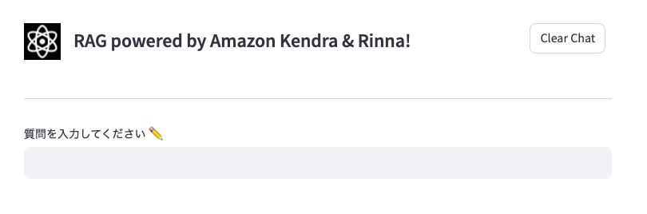

## 必要なモジュールのインストール

pipを利用している場合
```bash
pip install -r requirements.txt
```

Condaを利用している場合
```bash
conda env create -f environment.yml 
```

エラーとなる場合はカレントディレクトリが*./soruce*になっていることを確認してください。

## 環境変数のセット
以下のコマンドを実行して環境変数をセットします。
*kendra_chat_rinna.py*のコードを直接変更して環境変数をセットしていただいても構いません。

```bash
export AWS_REGION="<YOUR-AWS-REGION>"
export KENDRA_INDEX_ID="<YOUR-KENDRA-INDEX-ID>"
export RINNA_ENDPOINT="<YOUR-SAGEMAKER-ENDPOINT-FOR-RINNA>"
```

### RAGサンプルアプリケーションの実行

```bash
streamlit run app.py rinna
```

出力されるURLを開くとデモアプリケーションが表示されます。
もし、うまく接続できない場合は（AWS上のインスタンスで実行している場合）セキュリティグループ等の設定をご確認ください。

